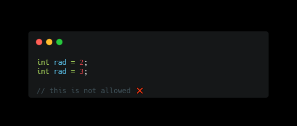
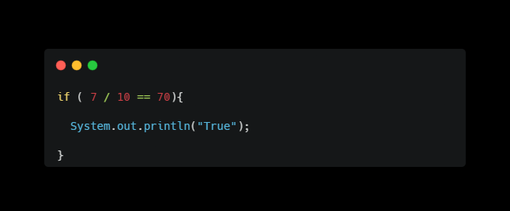
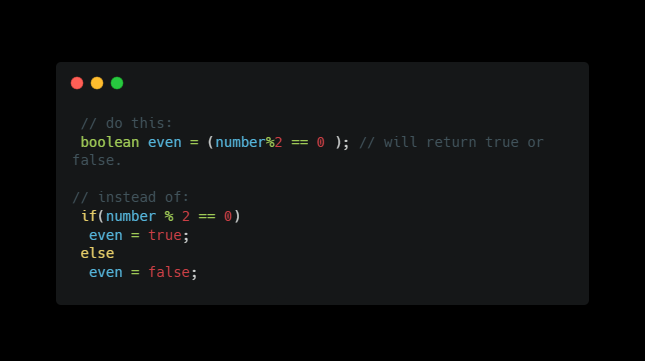
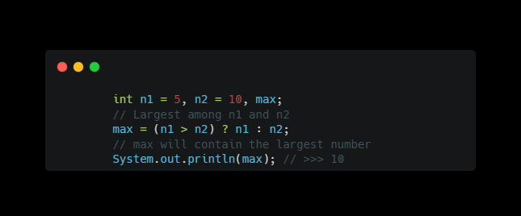

# Java Miniatures

Java Miniatures is a comprehensive repository dedicated to honing Java programming skills and delving into software engineering concepts. As a passionate Computer Science graduate aspiring to excel in the field of Software Engineering, I've curated this repository to serve as a platform for my continuous learning journey and to showcase my expertise in Java programming.

## **What the Repository Does:**

The repository encompasses a wide range of **Java topics**, starting from fundamental concepts and progressing towards more advanced **software engineering principles**. Each section of the repository is meticulously crafted to provide clear explanations, code examples, and practical projects, all aimed at deepening understanding and mastery of Java and its application in real-world software development scenarios. The repo will include the fundamental Computer Science topics.

## **Challenges Faced and Future Features:**

Throughout this learning journey, I've encountered various challenges, both technical and conceptual. However, each challenge has served as an opportunity for growth and learning. In the future, I aim to implement additional features such as interactive coding exercises, more extensive project examples, and collaborative learning opportunities to further enhance the repository's utility and effectiveness as a learning resource.

 <H1>Table of Contents</H1>

 <H3>Part One : Pick up your weapon !</H3>

<strong>Java Basics</strong>

1. Elementary Programming
2. Control Structure Part 1: (_Selections_)
3. Mathematical Functions,Characters, and Strings
4. Control Structure Part 2: (_Iterators_)
5. Methods
6. Arrays

<strong>Object-Oriented Programming</strong>

1. Objects and Classes
2. Object-Oriented Thinking
3. Inheritance and Polymorphism
4. Exception Handling and Text I/O
5. Abstract Classes and Interfaces

<strong>Java in Action</strong>

1. Build tools

- Ant
- Maven
- Gradle

2. building GUI

- JavaFX
- Java Swing

3. Web Frameworks

- Spring
- Springboot

4. ORM

- JPA
- Hibernate

<strong>Advanced Java Topics</strong>

1. Binary I/O
2. Generics
3. How JVM works
4. Multithreading and Parallel Programming
5. Networking
6. Java Database Programming

<strong>Data Structures</strong>

1. Recursion
2. Stacks & Queues
3. Lists
4. Trees
5. Priority Queues
6. Maps & Hash Tables
7. Search Trees

<strong>Algorithms</strong>

1. Asymptotic analysis
2. Sorting
3. Searching
4. Graphs
5. Strings

<H3>Part Two: Software Engineering Principles</H3>

1.  OOA & OOD
2.  SOLID Principles
3.  Design Patterns
4.  Refactoring Techniques
5.  Software Development Methodologies

<h3>Part Three: Projects</h3>

1. Small-scale Java Projects
2. Medium-scale Software Engineering Projects
3. Real-world Application Examples

<H3>Cross-Part knowledge</H3>

**_Challenges and Exercises_**

- Coding Challenges
- Problem-solving Exercises
- Algorithm Implementations

**_Resources_**

- Online Tutorials and Courses
- Recommended Books
- Useful Articles and Videos

**_Contributions_**

- How to Contribute
- Guidelines for Contributors
- Community Engagement Opportunities

---

## Part One : 1 - Java Basics

### **Get-Started** :D 🔥

according to Java Docs official website [Oracle Docs](https://docs.oracle.com/en/java/).

> \'Java is a general-purpose, concurrent, strongly typed, class-based object-oriented programming language'

- #### _**general puprose**_ means you can build applications using this language in a wide range of different domains.

- #### _**concurrent**_ means the ability of the language to execute mulitple processes in the same time

- #### **_strongly-typed_** means the strict attatchment of language syntax to define variabels datatypes

- #### **_class based object oriented_** means this language structure is based on object oriented concepts and use of classes

Don't worry **these charactaristics of the labguage will be more clear as we go in this repo**

---

<H3><strong>Installing JDK</strong><H3>

click on the following link [oracle](https://www.oracle.com/eg/java/technologies/downloads/) and install the latest JDK versions on your own device

download and install JDK based on your os and processor acritecture set

"**_JDK_**" stands for Java Development Kit, it's the development environment for building java applications, it consists of JVM -_Java Virtual Machine_-, JRE -_Java Runtime Environment_- and development tools like compiler etc.

Java is machine independent language or it's more decriptive to refer to it as platform-independent; you can run it on any platform, while the JVM is platform-dependent; different JVM is designed for each platform (Linux, Windows, MacOs).

Once you downloaded the latest version of JDK here you have two options:

1.  if it's your first time downloading

    > you need to edit system environment variables first

    These instructions for windows users only ⚠:

    - open your Program Files directory navigate till you find the jdk directory
    - open the bin directory then copy its path
      
    - press win key on your kewboard ⌨ then type in search bar down edit system environment variables
    - click on Evironment Variables, from user variables choose path then click on edit
    - on path window click add new, then paste the path you copied earlier and press enter
    - click on move up to make it on the top of the list and voila!

2.  if you've already installed earlier JDK version

        - open your cmd(win key, type cmd | win key + R then type cmd)
        - write the following:

          > `java -version`

        

        I have JDK version 17 installed on my own, now we are going to switch it to the new version of JDK

        - we'll repeat the steps of the previous option (editing system environment variables, etc)
        - Check your java version again in cmd (restart it if you didn't close it already)

        _and Voila!_

        

    

---

<H3><strong>1. Elementary Programming</strong><H3>

Remember this part mentioned earlier ? [class-based](#class-based-object-oriented-means-this-language-structure-is-based-on-object-oriented-concepts-and-use-of-classes)

> Java is a **class-based object-oriented** programming language

Let's see how this concept was applied!

_*Writing your first Hello world program!*_:-D

_prerequisites_ ⚠

> if you didn't install the jdk yet, go to [this part](#installing-jdk) and install it
>
> It's better if you have an IDE, till this point it's not mandatory yet but then it will be as we are not at the age of DOS anymore.

1. If you don't have an IDE: (note: I won't let you stay lazy forever, you'll have to install it)

   - create a new directory (folder) for your java practice, right-click, new, text document
   - yes, that's it just empty document, rename this document "HelloWorld.java"
   - open the document, as mentioned before java is class based so to write any instructions they **must be** inside classes, now let's type our first class:

   > `public class HelloWorld{}`
   >
   > public & class are both keywords all written in lower case letters
   >
   > HelloWorld is the name of the classand it must be written in [pascal case](https://www.freecodecamp.org/news/snake-case-vs-camel-case-vs-pascal-case-vs-kebab-case-whats-the-difference/#pascal-case) (the first letter of each word is capital)
   >
   > inside the curly braces `{}` we are going to illustrate our code

   - keywords or reserved words are predefined words in a programming language with a specific use, you can't use them for naming (simply, because the compiler will be confused if it's the word used by the language to identify some order to be executed by the program or it's just a programmer defined variable)

   - every java program should at least have one class, to execute the program we should have a _main method_ (in other words method its name is "main")
   - inside our created class we define the main method as follows:
     > `public static void main(String[] args){}`
     >
     > public, static, void, String are all keywords
     >
     > naming methods using [camelCase](https://www.freecodecamp.org/news/snake-case-vs-camel-case-vs-pascal-case-vs-kebab-case-whats-the-difference/#camel-case) in java if it consists of more than one word other wise all lower case
   - the curly braces `{}` mean block of code, here we write the lines of code that will be executed, their place is after every class, method, control statements, specific keywords e.g. static keyword. They also represent a specific scope (we'll talk about this soon).
   - inside the curly braces of the main method we will print our first hello world
     > `System.out.println("Hello World!");`
     >
     > **Do Not Forget The Semicolon!**
     >
     > any string is enclosed in double quotes
     >
     > System.out.println() is the method we'll use for printing anything on the terminal or console screen to user.
   - to run your program open your cmd `win + R type cmd then enter ↩`, in the same directory, if you cannot navigate to the directory where the java file lies, simply in the address bar of your folder window type cmd as follows:
     

   - inside cmd type `javac {yourfilename.java}` (don't forget the extension)

   

   - write the name of the file right with its correct formate or you'll face `error: file not found`

   > **_javac_** stands for java compile, you'll notice that a `.class` file is created on your directory this is the `bytecode`. you compile one time and run the code infinitely.

   - to run the program write `java {yourfilename}` (note here without the extension).

   _and Voila!_

you can check the file here in this directory [Hello.java](/Test%20Files%20Elementary/Hello.java) file.

#### notes about java syntax:

- every programming language has a syntax define it, simply like grammar in English edfines how you form a sentence has context, simmilarly in programming the syntax allows you to write program instructions correct or with a context for the compiler.

- curly braces`{}` define a block of code -in other words **lines** of code- and also define scope.

- yup, just like C language semicolon is the statements terminator `;`

- `//` double slashes for single line comments and `/* comments lines go here */` for multiple lines of comments (for those who are new to programming, comments are setences or lines won't be treated as code or instruction they will be ignored by the compiler, programmers use comments to clarify points about their code, like comments show imcomplete implementation or reference to the original source code or even to clear confusion about the code they wrote)

- java is case sensitive language (you get syntax error if you mistyped a keyword or wrote its letetr capital rather than small or vice versa), e.g.

  > `Public void fun(){...}` --> syntax error (Public is not a keyword)

- parenthesis `()` follow functions names, flow control keywords like for, while, if...etc.

- while square brackets follow 'Array' types `[]` e.g.

  > `String[]` -> indecates array of type String.

- later in advanced java programming we will get familiar with the ArrayList, we will find the angle brackets `<>` follow ArrayLists keyword in which contain the Type of the ArrayList (ArrayList is simply resizable array) e.g.

  > `ArrayList<String>`.

- every java program must have at least one class.

- java program start execution from main method.

- string is enclosed in double quotes while character is enclosed in single quotes.

#### errors types:

- Syntax errors: mistyping, missing puncituation

- Runtime errors: occur while program is actually running if the IDE indeicated a process cannot be carried out or through input errors.

- Logical errors (semantic) -cruel one😈-:
  the code actually works fine but doesn't give you the expected output e.g. you wanted to make simple program that multiply numebrs. now look at the followin code:

  > int x = 2, y = 2;
  >
  > int result = x + y;
  >
  > System.out.println(result); >>>> 4 looks fine nothing wrong, no errors, the result is right :)

  try again making y = 3 instead of 2

  > int x = 2, y = 3;
  >
  > int result = x + y;
  >
  > System.out.println(result); >>> 5 here there is a problem, the code is working fine as no errors appear but wait a minute 😅, a plus " + " sign where inserted instead of " \* " multiplication sign.

  here where the error takes place, it's not in code it workds fine but doesn't give you the expected results, this type of errors are dedicted and corrected using tests we will come to this point later.

for more on errors types here is a useful link [not for new commers](https://www.geeksforgeeks.org/types-of-errors-in-java-with-examples/)
, this is nice introduction to errors [types of erros in java](https://www.scaler.com/topics/types-of-errors-in-java/).

#### variables:

- a variable is used to store data, you can think of variables as where we store values, these values can be numeric, string (group of characetrs), reference, etc.

- basic syntax to declare a variable in java

  > datatype {variable-name} = value;

  - declaring means you announce to your compiler about storage place of name (your variable name) and type (your variable type) and it has to reserve or allocate this amount of memory space.
  - definition is when you assign a value to this identifier or the variable, equal sign `=` is the assignment operator.
  - assignment is right-to-lef operation -**this is super important**-, as you say the value 3 is assigned to variable x of type integer for this statement `int x = 3;` .
  - obviously, we don't have to mention "**not to forget the damn semicolon `;` after each statement you write**", thank you :) .

- naming conventions:

  - camel case.
  - do not start naming a varable with a number
  - you can start your variable name with dollar sign `$` or with underscore `_`.
  - variables cannot be reserverd words, e.g. you cannot name your variable '_static_' gives you syntax error.
  - for clean code early teaching purpose, choose meaningful names for your variables describe them.
  - do not contain spaces in your variable name, keep using camel case if your variable name is more than one word.

- data types:

  - In general they are two types numerical or non-numerical, numerical like integers, floating point or decimal numbers, non-numrical like strings "Hello my name is" or boolean like True or False.
  - In java they are two categories, premitive data types and reference datatypes, they are classified based on how they store data, primitive copies only values while reference hold the address to the value they just copied, if you couldn't understand this no problem it will be clear later.
  - primitive data types are:
    - byte
    - short
    - int
    - long
    - float
    - double
    - boolean
    - char
  - reference data type -the only one you'll use for now- is String (take care of the capital letter).
  - data types tell the compiler how much space to reserve for that variable in memory. 

- **note** as variable word declares, its value can be changes during the execution of the program, from this point let's get familiar with constants.

- constants cannot change their value, we declare them using `final` keyword then data type follows final then the constant name, e.g.
  > final float PI = 3.14;
  - Upper case as naming convention for constants.
- **note** you cannot re-declare variable but you can re-assign i, e.g.

  
  

#### simple operations:

- you can perform simple operations using binary arithmetic operators: `+ , - , * , / , %`

  - 'astrisk' `*` is used for multiplication, 'single slash' `/` is used for division, and `%` is called modulus gives you the remainder, e.g.

    

  - note that `=` means assignment not equality.

#### taking user input

- for taking custom input from user, either from console or keyboard input, we are going to start using classes.

- In java to take user input using three classes: Console, BufferedReader, and Scanner. For now we will deal with Scanner only.

- first of all we need to import the class, so using the keyword `import` we will invoke the `Scanner` class as follows:
  

  - note that even in import we don't forget the semi colon :) .
    

- Then, we create a new object from Scanner class

  

  - we created object of name input of Scanner class using **new** operator.

  

- importing statement is placed before class declaration.

- simple java program takes input from user to calculate the area of a circle:
  you can simply see the file here: [ComputeCircleArea.java](/Test%20Files%20Elementary/ComputeArea.java)

  

- so, at any point you want to take user input:
  1. `import java.util.Scanner;`
  2. inside main mathod block of code
     `Scanner input = new Scanner(System.in);`
  3. based on what data you want to take, e.g. prompt user to enter integer:
     `int number = input.nextInt();`
     and that's it.

#### Jshell interactive tool as Java REPL (Read, Evaluate, Print, Loop)

- Read-Evaluate-Print Loop (REPL), which evaluates declarations, statements, and expressions as they are entered and immediately shows the results.

- it's an interactive tool for quickly prototyping java code, all without the need for a `public static void main` or the need to compile your code before executing it.

- it's super easy open your cmd or powershell and type jshell

- try simple declaring variable called hello, `var hello = "welcome to jshell"`

- find more on this link [how to use jshell](https://www.infoq.com/articles/jshell-java-repl/)

#### notes:

### First Chapter is Finished!!! :D

---

<H3><strong>2. Control Structure Part 1: (_Selections_)</strong><H3>

In this section you will learn **the way you take decision**.

According to documentation:

> control flow statements, break up the flow of execution by employing decision making, looping, and branching, enabling your program to conditionally execute particular blocks of code.

types of control flow statements:

1. Decision making statements.
2. Iteration (Looping) statements.
3. Branching statements.

in this section we'll talk about **Selections** | **Conditionals** | **Decision Making statements**.

Conditional keywords: `if`, `else`, `else if`,`switch`,`case`,`break`.

#### 1. If statements:

Conditional statement evaluate a (condition) if it's true or false to perform set of instructions:

a boolean expression is expression will yeild true or false, e.g. is 4 + 5 = 9? if their sum equal to nine so the answer is yes otherwise no. so, an expression will be given to be evaluated.

now, the question is how to build a conditional:

before anything let's learn about the second category you hear in this guide, **relational operators**:
`==`
`<=`
`>=`
`!=`
`>`
`<`

> note that assignment operator `=` is not the same as `==` equality operator, equality operator mean if the value of smth **equals** some value on the other hand the assignment oeprator assigns value to variable.

Conditionals evaluate boolean expressions, boolean expression are expression expected to have true or false as answer so we are kinda building comparison statments.

it's simply like saying: is multiplying 7 by 10 equals 70? if yes please print the result and if not do nothing.

- Checking for alternatives:
  using else if we can check for alternatives, e.g.
  here is a simple program to check if a number is positive or negative or equal to 0:

  

- you can find more examples in Test Files Elemntary, e.g. [addition Quiz](./Test%20Files%20Elementary/AdditionQuiz.java)

we can check using `if` then another `if` but what we hit the goal from first time why do we continue checking? that's why we use else if instead of if to skip the rest of conditional statement checking if we already satisfied one.

#### notes:

- any boolean expression is enclosed by parenthesis `()`.
- if by mistake you placed a semicolon after if statement `if ( y == x );` is like doing this: `if ( y == x ){}` means do nothing.
- avoid redundant testing of boolean expression e.g. `if (even == true)` better do this `if (even)`, so if even have a number other than zero it sill evaluate to true or if even a boolean variable it will evaluate to its boolean value.
- avoid equaltiy test to float variables to avoid percision problem of floating point numbers.
- you can simplyfy boolean variable assignment:
  

now we could build simple conditionals using of, else and if else. What if we want to check two conditions at the same time, can we? actually yes, using compound boolean expressions we can check two conditions at the same time, but first let's get familiar with the logical operators:

`|| OR operator`

`&& AND operator`

`! NOT operator`

`^ XOR operator`

if you are a computer science, or electrical engineering student you are already familiar with thess operators as you took this knowledge in Logic design course -probably it's name nearly like this-, if you or not here's a simple explaination and I'll provide you a link for a video to simplify the concept more:

OR operator `||` check if one of the expressions `at least` is true or both of them.
e.g. `(5+6 == 11 || 5+7 == 11)` evaluates to true because the first expression is true. it will only evaluates to false if both of them are false.

AND operator `&&` check if both of the expressions `must be true` if one of them is false so the whole evaluation of both of them will be false.

NOT operator `!` is to negate any value to oppose any expression in other words: !(expression) means to flip the evaluation value of this expression if it's evaluated to true the not operator will make it false and so on. same when we use `!=` we mean not equal.

XOR operator `^` is used to check if both expressions evaluates to different answers, simply if both of the expression is evaluated to true or both false it return to us false, if they are different (true , false or false , true) return to us true.

we can use DeMorgan's law to best practise these compound boolean expression conditionals

> !(condition1 && condition2) == ! condition1 && ! condition2 using DeMorgan's.

**note** `&&` and `||` are called lazy operator as they perform short circuit concept as if `false && anything` evaluates to false without checking the second expression same in `true || anything` will evaluate to true without checking the second expression.

#### 1. Switch case statements:

we use switch case statements with menu-like -means many choices- problems, e.g. choosing operation to be done on numerical values, based on day of week choosen perform some action:

This is a simple program perform basic operations on the entered numbers:
you can check it from here [switch program](./Test%20Files%20Elementary/Calculator.java)

- if `break` is not used, switch will evaluate all other cases, we use default if the expression doesn't match any case.

lastly we will learn about the boolean ternary operator `(boolean expression)? (if true)expression1 : (if false)expression2` this oeprator return exp1 if it evaluates to true and exp if it evaluates to false, e.g. :

#### notes:

### Second Chapter is Finished!!! :D

---
